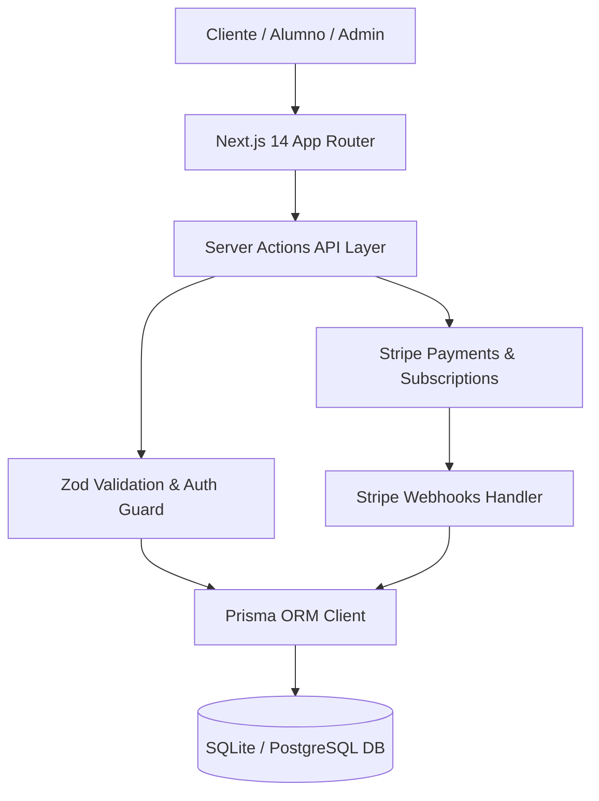

# ARQUITECTURA TÉCNICA & DISEÑO DE SISTEMA: ACADEMIA DE AJEDREZ ALEKHINS

## 1. Visión General de la Arquitectura
**Academia de Ajedrez Alekhins** está construida sobre **Next.js 14+ (App Router)** utilizando TypeScript estricto, Prisma ORM y Tailwind CSS con tokens de diseño personalizados definidos en `DESIGN.md`.

---

## 2. Modelado de Datos & Relaciones de Base de Datos
* **User & Auth**: Soporte de roles RBAC (`SUPERADMIN`, `ADMIN`, `OPERACIONES`, `STUDENT`, `CUSTOMER`). Separación de tutores/padres y alumnos menores de edad.
* **Catálogo & Variantes**: Productos de ajedrez con imágenes múltiples, SKU único, variantes por color/tamaño/material y stock reservado.
* **Suscripciones & Planes**: Planes de entrenamiento con facturación recurrente (mensual/anual) y cancelación en 1-clic.
* **Transacciones de Inventario**: Historial auditado de movimientos de stock con fecha, usuario y razón social.
* **CRM Leads & Cotizaciones**: Registro de prospectos para escuelas, paquetes institucionales de 5 a 50 juegos.

---

## 3. Seguridad & Prevensión de Fraude
1. **Recálculo Estricto en Servidor**: Los precios, descuentos de cupones, impuestos y gastos de envío se recalculan siempre en el servidor. Nunca se confía en valores de precios enviados por el navegador.
2. **Firma de Webhooks de Stripe**: Verificación de firmas con `STRIPE_WEBHOOK_SECRET` para prevenir suplantación.
3. **Control de Acceso Basado en Roles (RBAC)**: Protección de rutas `/admin/*` y `/mi-cuenta/*` verificando sesiones activas.
