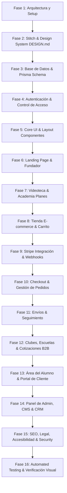

# PLAN DE PROYECTO: ACADEMIA DE AJEDREZ ALEKHINS

## 1. Visión General
**Academia de Ajedrez Alekhins** es una plataforma web integral, moderna y escalable que combina tres pilares fundamentales:
1. **Academia**: Planes de entrenamiento y formación en ajedrez.
2. **Fundador y Contenido**: Perfil profesional, currículum vitae interactivo y videoteca del **Maestro Internacional Roberto Martín del Campo Cárdenas**.
3. **Tienda E-Commerce**: Venta online de material de ajedrez (sets de torneo, tableros, piezas, relojes, libros, equipamiento escolar y accesorios).

---

## 2. Definición de la Arquitectura & Stack Tecnológico

### Stack Principal
* **Framework**: Next.js 14+ (App Router, Server Components & Server Actions)
* **Lenguaje**: TypeScript (Tipado estricto)
* **Estilos**: Tailwind CSS + Custom Tokens CSS (Negro Carbón `#121212`, Marfil `#FDFBF7`, Gris Piedra `#2A2A2A`, Nogal `#3E2723`, Champagne `#D4AF37`)
* **Base de Datos & ORM**: PostgreSQL / Prisma ORM (con migración y seed completo)
* **Autenticación**: NextAuth.js / Auth.js con JWT cifrado, soporte para Roles (`SUPERADMIN`, `ADMIN`, `OPERACIONES`, `STUDENT`, `CUSTOMER`) y separación de perfiles (Tutor/Padre y Alumno menor)
* **Pasarela de Pagos**: Stripe API (Stripe Checkout / Payment Elements, Webhooks con firmas verificadas e idempotencia)
* **Íconos & Animaciones**: Lucide React + CSS Micro-animations / Framer Motion
* **Búsqueda & Filtrado**: Motor de búsqueda global multi-entidad (Productos, Planes, Videos, Artículos, Entrenadores)
* **SEO & Analytics**: Metadata API, Schema.org (Product, Course, Person, Organization), GA4 Mock Layer / Analytics SDK

---

## 3. Coordinación de Agentes Especializados

Para garantizar máxima calidad en cada dominio, Antigravity coordina internamente las siguientes responsabilidades:

| Agente Especializado | Responsabilidad Principal |
| :--- | :--- |
| **Arquitecto de Software** | Diseño de arquitectura modular en Next.js, Server Actions, estructura de carpetas, middleware y API contratos. |
| **UX/UI & Stitch Agent** | Integración con Google Stitch MCP, creación de `DESIGN.md`, tokens tipográficos editoriales, micro-interacciones. |
| **Frontend Engineer** | Componentes React reutilizables, Mega-menú, Carrito Drawer, Galería de producto, Comparador de planes, Timeline CV. |
| **Backend & DB Engineer** | Esquema Prisma completo, migraciones, relaciones de base de datos, Server Actions con validación Zod, Seeds de demostración. |
| **E-Commerce & Stripe Specialist** | Carrito persistente, checkout seguro, cálculo de totales en servidor, Stripe Webhooks (suscripciones y pagos únicos), gestión de inventario. |
| **Security & Auth Specialist** | Autenticación RBAC, rate limiting, sanitización de inputs, protección CSRF/XSS, headers HTTP seguros, auditoría de logs. |
| **CMS & CRM Engineer** | Admin dashboard (`/admin`), CMS de banners/secciones/fundador, gestor de leads y cotizaciones B2B para escuelas. |
| **SEO, Accessibility & Quality Assurance** | WCAG 2.1 AA (contrastes, aria, navegación por teclado), Open Graph metadata, Schema.org, unit & integration tests, E-commerce flow audit. |

---

## 4. Fases de Desarrollo

---

## 5. Matriz de Entidades de Base de Datos (Prisma Schema)
1. `User` / `Account` / `Session`
2. `Customer` / `Student` / `Guardian` / `Coach`
3. `Address`
4. `Category` / `Product` / `ProductVariant` / `ProductImage` / `Review`
5. `InventoryTransaction`
6. `Cart` / `CartItem`
7. `Order` / `OrderItem` / `Payment`
8. `Shipment` / `ShipmentEvent`
9. `Coupon`
10. `TrainingPlan` / `Enrollment` / `Subscription` / `Lesson`
11. `Video` / `VideoCategory` / `VideoAccess`
12. `Article` / `Guide`
13. `Lead` / `InstitutionalQuote`
14. `NewsletterSubscription` / `MarketingConsent`
15. `LegalDocument` / `LegalAcceptance`
16. `SiteSettings`
17. `AuditLog` / `ProcessedWebhookEvent`

---

## 6. Verificación & Criterios de Aceptación
* **Cero Placeholders Rotos**: Todos los botones de acción (`Añadir al carrito`, `Comprar`, `Filtrar`, `Buscar`, `Aplicar cupón`, `Cotizar`) funcionan realmente.
* **Seguridad Estricta**: Recálculo obligatorio de precios e impuestos en servidor durante el checkout.
* **Diseño Editorial Premium**: Cumplimiento del `DESIGN.md` derivado de Google Stitch.
* **Responsive Multi-Dispositivo**: Pruebas visuales en breakpoint 375px, 768px, 1024px, 1440px y 1920px.
